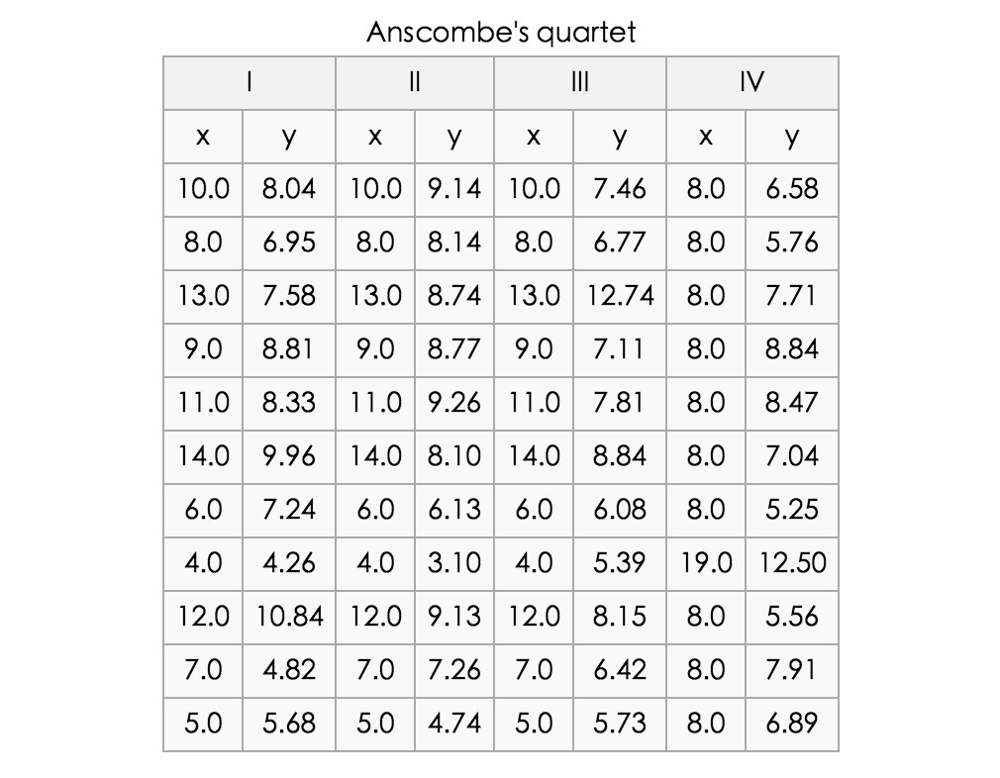
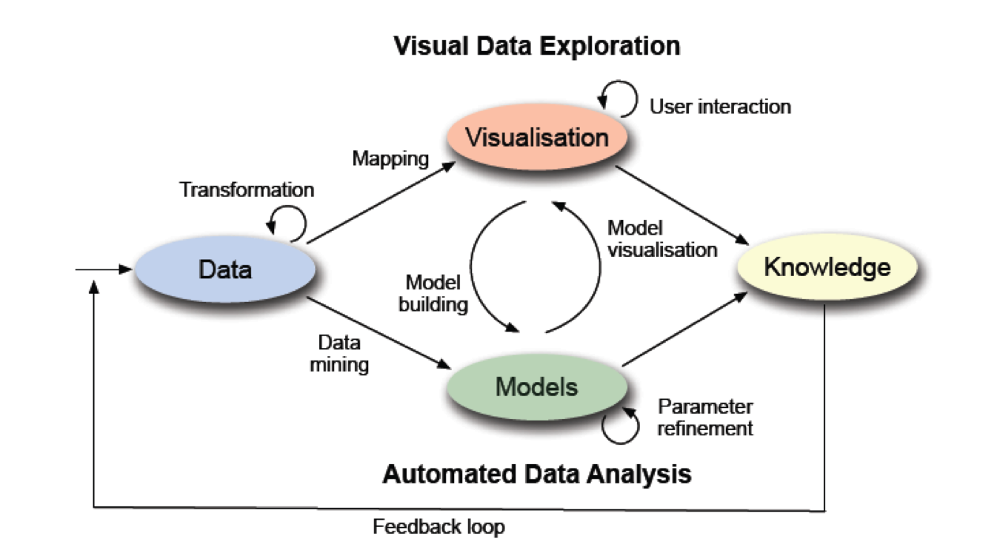

# Echarts Next

### —— 数据 · 视觉编码 · 交互

Echarts团队

Note:
自我介绍

---

### Echarts Next

##### {0|3.0 alpha}

{0|}

----


---

##数据 · 视觉编码 · 交互

----


----


Note:
前注意视觉，视觉突出

----


Note:
哪个年龄段及收入水平人群的三酸甘油脂水平（身体脂肪量）趋势与其他均不同？

----


----


### {0|视觉感知}

> {0|客观事物通过人的视觉在人脑中形成的直接反映}

### {1|认知}

> {1|信息的获取、分析、归纳、解码、储存、概念形成、提取和使用}

### {2|**擅长**}

Note:

在可视化与可视分析中，用户是所有行为的主题，通过视觉感知器官获取可视信息，编码并形成认知。感知和认知能力直接影响着信息的获取和处理进程

大部分人对于数字，文本等形式存在的非形象化信息的直接感知能力远远落后于对于形象化符号视觉的理解

数学老师死得早，数学是体育老师教的

----



Note:

再举个例子，相关系数。
安斯库姆四重奏（Anscombe's quartet）是四组基本的统计特性一致的数据，但由它们绘制出的图则截然不同。每一组数据都包括了11个(x,y)点，
四组数据里 x**均值方差**全相等，y**均值方差**基本相等，x与y的**相关系数**也很接近。导致的结果是，四组数据**线性回归**的结果基本一样。
但是，这四组数据**本身差别很大**。
分析数据前先绘制图表的重要性

----

{1|~[800*500](./asset/ec-demo/anscombe-quartet.html)}

---


# 数据


----


### 类别

* {0|数值}

    * {0|10米 5mA 2048KB 312天}

* {1|有序}

    * {1|小，中，大}
    * {1|周一，周二，周三}

* {2|类别}

    * {2|北京，南京，开封}

* {3|维度}

    * {3|一维、二维、三维、n维}

* {4|关系}

    * {4|树、图（网络）}


Note:
可视化的设计、ec的制作中，考虑对数据从这些类别上来刻画。
映射、视觉元素


---

# 可视编码

* {0|标记（图形元素）}
* {1|视觉通道}

Note:

可视编码由两部分组成:标记 和 视觉通道（用于控制标记的视觉特征）

可视编码是信息可视化的核心，是将数据信息映射成可视化元素的技术。

----

## 标记

<div style="min-width: 1050px">
<div style="float:left;">
{0|
点
~[350*400](./asset/ec-demo/glyph-point.html)
}
</div>

<div style="float:left;">
{1|
线
~[350*400](./asset/ec-demo/glyph-line.html)
}
</div>

<div style="float:left;">
{2|
面
~[350*400](./asset/ec-demo/glyph-area.html)
}
</div>


Note: 这个大家都知道。

----

## 视觉通道

{0|颜色&nbsp;&nbsp;&nbsp;亮度&nbsp;&nbsp;&nbsp;饱和度&nbsp;&nbsp;&nbsp;透明度&nbsp;&nbsp;&nbsp;色调
}
{1|尺寸&nbsp;&nbsp;&nbsp;形状&nbsp;&nbsp;&nbsp;纹理&nbsp;&nbsp;&nbsp;方向}
{2|动画}


Note:
生物学上，视觉通道指的是“大脑接受外部世界视觉信息的通道”，是“通过眼睛接受外界光线的明暗、色彩、形状等，产生对事物的辨别与记忆能力”

但是在可视化中，可能没有给予足够的意识

1.类型（type）
    是什么/在哪里（what/where）
    何种程度（how much）

其中视觉通道要求：
2.表现力（expressiveness）
    要求通过准确编码，来表达数据的完整属性
    判断标准：精确性、可辨性、可分离性、视觉突出
3.有效性（effectiveness）
    通道表现力符合数据属性的重要性

一个好的动画除了让人感到情怀之外还能够从某个角度去阐释数据，或者突出数据

下面是一些视觉通道的解释

----

### 颜色


{0|类别型数据}

{1|~[800*500](./asset/ec-demo/color-category.html)}

----


#### 颜色 - 类别型数据

{0|~[900*600](./asset/ec-demo/color-category-scatter.html)}

Note:
人们在观察事物的时候，会自然地根据事物的相似性进行感知分组

----


#### 颜色的亮度 - 数值型数据

{0|~[900*600](./asset/ec-demo/color-grey.html)}


----

#### 颜色的亮度 - 数值型数据

{0|~[900*600](./asset/ec-demo/heatmap-cartesian.html)}

----

#### 颜色 - 多种视觉通道

<div style="text-align: center; width: 1110px;">

<div style="display:inline-block;vertical-align:middle;width: 300px">

更多的维度<br>


</div>


<div style="display:inline-block;vertical-align:middle;width: 800px">


{0|~[1000*500](./asset/ec-demo/color-mix-aqi.html)}

</div>
</div>

Note:
这是一个使用多种视觉通道表示多维数据的例子。
圆的面积表示 PM2.5的浓度，颜色明暗表示SO2的浓度。
通过调整数据选择器，可以直观反应一些问题。

这组数据可以被映射到亮度(Lightness)、饱和度(Saturation)、透明度(Alpha)、形状(symbol)、大小(symbolSize)

通过交互可以筛选突出我们需要的那部分数据

----

### 三维 · 高度

{0|~[1280*650](./asset/ec-demo/global-population.html)}


----


### 形状

~[1000*500](./asset/ec-demo/symbol.html)

----


### 形状

~[1000*500](./asset/ec-demo/symbol-categories.html)

Note:
虽然可以把数据映射到形状上，但是效果并不如颜色和大小，
所以把重要的映射到人感知比较敏感的视觉通道上。

----

## 动画

* {0|带来工程的复杂性}

    * {0|软件脆弱}
    * {0|代码繁杂}

* {1|表达 数据/图形元素在**变化**中的**联系**，助于理解}

Note:

（1）虽然动画带来工程角度的复杂性，使代码更难维护和抽象，增加软件的脆弱（带来bug），增加代码的繁杂（性能优化）。
（2）但是表达交互中数据/图形元素变化的联系，比突变的数据展现更助于理解。

因为我们觉得动画在可视化交互中有比较好的效果，是很重要的一点，因此在动画绘制方面花了一些大的精力去处理。增加了更好的视觉实现。

----

### 视觉突出

~[1200*600](./asset/ec-demo/map-aqi.html)

Note:
Bling Bling

<!--
这个不讲了

### 色彩设计原则

* 避免过多颜色交错导致的杂乱无章
* 使用中性背景色，控制对全局色彩的影响
* 最小化同时对比
-->

----

### 数据的变化

~[1200*600](./asset/ec-demo/life-expectancy.html)


Note:
这是在 Gapminder 上一个经典的数据可视化分析工具，将世界各国的各种数据通过气泡图来展现，并且增加了动画效果，便于观察某项数据的变化情况。
横坐标=>人均收入，纵坐标=>人均寿命，气泡颜色=>国家，气泡的大小=>总人口。

原始数据的国家比较多，保留了主要国家演示。

结论：
经过二战以后，各国都快速发展，中国在61-62年期间数据大幅下降——三年灾害
二战后美国迅速崛起、改革开放以后，中国迅速发展、但欧美远超亚洲、挪威遥遥领先、朝鲜垫底

修改各个维度的数据，就可以呈现多种结论。非常有意思


----

### 线数据的方向

~[1200*600](./asset/ec-demo/migration2.html)

---

# 交互

----

### 反馈回路



Note:
单独拿出来讲一下，是因为以前的数据可视化，大都只是单一的图形展现。
但是这样就减弱了人对数据的作用，减少了数据对人的反馈。

这是个 “可视分析模型” 图。
数据->可视化->通过交互操作，再反馈到数据的变化。 在通过不同的可视化获得最终的知识。
只是以这个为例说明用户参与的反馈回路。
期间，人脑是需要重度参与其中的


----

### 可视化设计原则

<div style="text-align: center">

<div style="display:inline-block;vertical-align:top;width: 500px;">
{0|【交互操作】}


* {0|总览（overview）}
* {0|缩放（zoom）}
* {0|过滤（filter）}
* {0|按需细节<br>（details-on-demand）}
* {0|相关（relate）}
* {0|记录（history）}
</div>

<div style="display:inline-block;vertical-align:top;width: 400px;">

{1|【可视化箴言】}

* {1|总览为先（Overview first）}
* {1|缩放过滤（zoom and filter）}
* {1|按需查看细节（details on demand）}

</div>

</div>

Note:
可视化交互过程中，一般有一下这些操作：总览、缩放、过滤、查看细节等

----

#### 数据缩放 - 单一维度选择

~[1000*500](./asset/ec-demo/dataZoom-K-line.html)

Note:
现实中比较常见的就是股市的 K线图.

----

#### 数据缩放 - 多维度选择

~[1000*500](./asset/ec-demo/dataZoom-cartesian-hv.html)

Note:
这是一个有3000多条数据的柱状图，通过拖拽数值区域控制器，可以进行局部的数据的显示。
横轴时间，纵轴为下水量。先查看总体趋势，在查看细节信息。

----

#### Treemap

~[1400*650](./asset/ec-demo/hierarchy-obama.html)

----

# 各种数据的可视化


Note:
以上数据可视化过程中的基本概念就介绍结束了。接下来看下实际可视化场景中的例子。

----

### 点数据的可视化


{0|~[1000*500](./asset/ec-demo/map-weibo.html)}

Note:
点数据 ——
描述地理空间中离散的点，具有经度和纬度的坐标，但不具备大小和尺寸，
包括地图上的地标、附件的美食等

最直接的可视化点数据的方法
根据坐标直接标识在地图上，圆点是最常用的标识符号，其他标识符号还有向量箭头


weibo签到：11.8w 数据

----

### 线数据的可视化 - 2D
{0|~[1200*600](./asset/ec-demo/migration.html)}

Note:
2015年百度迁徙的数据，地图上的线表示的人口迁徙的方向

----


### 线数据的可视化 - 3D

{0|~[1200*600](./asset/ec-demo/global-airline.html)}

Note:
线数据通常指连接两个或多个地点的线段或路径，线数据具有长度属性，即经过的地理距离
可以揽到美国机场更多集中在东西岸


----

### 场 · 向量

<div style="width: 600px; float:left">
{0|}
</div>
<div style="width: 350px; float:left">
{1|}
</div>

Note:

NASA Perpetual Ocean

----

~[1200*650](./asset/ec-demo/global-wave.html)

Note: 洋流信息 05年 NASA 给出的一份洋流数据

----


### 时间数据的可视化


{0|~[1000*500](./asset/ec-demo/dataZoom-cartesian-hv.html)}

Note:
横轴是时间。

----

~[1000*500](./asset/ec-demo/timeline-ecnomic.html)

Note:
时间作为更高层的一个维度。


----

### 高维数据 - 平行坐标轴

{0|~[1100*600](./asset/ec-demo/parallel-aqi.html)}

Note:

平行坐标用于表现高纬度的数据，他克服了传统笛卡尔坐标系（直角坐标）下对空间占用的消耗，难以表达三维以上的数据，
可以在一个平面上显示更多维度的数据。
这里是空气质量在不同时间下，不同数据的表现。

----

### 关系数据

{0|树}

{1|图}


----

#### 层级数据的可视化（树）


{0|~[1000*600](./asset/ec-demo/hierarchy-tree.html)}

Note:
层级数据，无回路，我们可以直接画出来
但是能表达的就只有层级了， 如果需要表达更多的维度，比如每一个层级数据的大小，面积？

----


~[1400*650](./asset/ec-demo/hierarchy-obama.html)

Note:
国外比较流行的
visual mapping
奥巴马2012政府财政预算.
2012和2011比较，也可以将这两部分的差值映射到民安的变化上去。
退伍军人veterans的数据

----

下钻

~[1400*580](./asset/ec-demo/hierarchy-disk.html)


----

#### 网络数据的可视化（图）


{0|~[1400*600](./asset/ec-demo/graph-layout.html)}

Note:
网络数据
可以表示点和关系的信息，可视化中用的比较多，可以很清晰的看到数据的关系和权重
graph 多种layout。


----

#### 力导向

{0|~[1400*600](./asset/ec-demo/force-webkit.html)}


Note:
webkit 内核中核心技术的关系
每个点都拥有引力和斥力，相近相斥，离远相吸。经过多次的布局迭代，就可以达到一个稳定的布局结构。

### 更多维度

```
[
    [1,55,9,56,0.46,18,6,"良"],
    [2,25,11,21,0.65,34,9,"优"],
    [3,56,7,63,0.3,14,5,"良"],
    [4,33,7,29,0.33,16,6,"优"],
    [5,42,24,44,0.76,40,16,"优"],
    [6,82,58,90,1.77,68,33,"良"],
    [7,74,49,77,1.46,48,27,"良"],
    [22,84,94,140,2.238,68,18,"良"],
    [23,93,77,104,1.165,53,7,"良"],
    [24,99,130,227,3.97,55,15,"良"],
    [25,146,84,139,1.094,40,17,"轻度污染"],
    [26,113,108,137,1.481,48,15,"轻度污染"],
    [27,81,48,62,1.619,26,3,"良"],
    ...
]
```

----

~[1000*500](./asset/ec-demo/color-mix-aqi.html)

Note:

比较，首先用前面的color-mix:
在二维/三维图表上增加视觉通道，以表达更多的属性信息。
但是 ...


----

### 字符云

~[1000*500](./asset/ec-demo/word-cloud.html)

Note: 字符云，通过字体大小和位置，来表示某些关键词的频次高低以及重要性。


暂时不讲

### 高维数据 - 协同分析

~[1000*500](./asset/ec-demo/data-coop-scatter.html)


### 高维数据 - 散点图矩阵

~[1000*500](./asset/ec-demo/data-coop-scatter.html)


----

### 热力图

~[1000*600](./asset/ec-demo/heatmap.html)


----

## AND

### {0|More...}

Note:


----

### 优化

<div style="text-align: center">
<div style="display:inline-block;vertical-align:top;width: 400px;">
{0|Echarts 2.0}
{0|363K}
{0|363K + 35K}
</div>
<div style="display:inline-block;vertical-align:top;width: 400px;">
{0|Echarts 3.0}
{0|**120K**}
{0|**120K** + **71K**}

</div>
</div>

Note:
核心包对比，2.0基础折柱饼
折柱饼+直角坐标系

----

###  For FREE!

----

{0|更**专业**的图表}
{0|更**丰富**的种类}
{0|更**漂亮**的配色}
{0|更**清晰**的文档}
{0|更**精简**的尺寸}
{0|更**多样**的适配}
{0|更**方便**的二次开发}
{1|...}

----

https://echarts.baidu.com

https://github.com/ecomfe/echarts


---


## 谢谢


